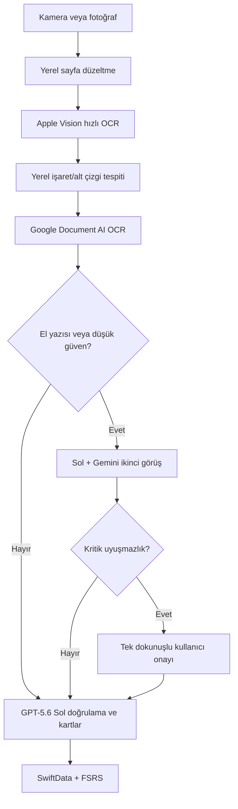

# Kişisel Tıbbi Hafıza Uygulaması — Ana Ürün ve Teknik Uygulama Planı

> **Belge amacı:** Bu dosya Claude Code, Codex veya başka bir yazılım geliştirme ajanına doğrudan verilebilecek ana proje şartnamesidir. Ürün kararı, kapsam, mimari, veri modeli, API sözleşmeleri, kalite kapıları, testler ve geliştirme sırası bakımından kaynak kabul edilmelidir.

Belge tarihi: 1 Ağustos 2026
Durum: Uygulamaya hazır ürün/teknik plan
Çalışma adı: Çizgi
Hedef kullanıcı: Tek kullanıcı — uygulamanın sahibi, hekim ve TUS öğrencisi
Hedef platform: Native iOS, SwiftUI
Ticari hedef: Yok
Birincil başarı ölçütü: Kitaptan işaretlenen bilginin mümkün olan en az sürtünmeyle doğru biçimde karta dönüştürülmesi ve uzun süre hatırlanması

────────

## 0. Geliştirme ajanına bağlayıcı talimat

Bu projeyi uygulayan ajan aşağıdaki kuralları takip etmelidir:

1. Bu belgeyi kod yazmaya başlamadan önce baştan sona oku.
2. Ürünü genel amaçlı planlayıcıya, not uygulamasına veya ticari abonelik ürününe dönüştürme.
3. MVP'ye kullanıcı hesabı, paywall, sosyal özellik, reklam, genel sohbet botu veya hasta yönetimi ekleme.
4. Ana deneyimi şu sırada koru: çek → otomatik algıla → gerekirse tek dokunuşla doğrula → arka planda kart üret → zamanı gelince tekrar et.
5. OCR veya LLM belirsizliğini kullanıcıdan saklama. Özellikle tıbbi anlamı değiştiren sayı, birim, olumsuzluk, yön ve sembollerde sessiz otomatik düzeltme yapma.
6. API model adlarını, eşik değerlerini ve maliyet sınırlarını kodun çeşitli yerlerine gömme; merkezi ve değiştirilebilir yapılandırmada tut.
7. API anahtarlarını iOS uygulamasına gömme veya repoya commit etme.
8. Tüm hesaplama ve tekrar planlama mantığını deterministik kodda tut. LLM yalnızca görüntü/metin yorumlama ve içerik üretiminde kullanılmalıdır.
9. Her faz sonunda ilgili kabul testlerini çalıştırmadan sonraki faza geçme.
10. Kullanıcının mevcut, ilişkisiz dosyalarını veya git değişikliklerini silme ya da değiştirme.
11. Belirsiz bir ürün kararıyla karşılaşırsan bu belgedeki ürün ilkelerine göre en küçük, geri alınabilir çözümü seç; ana akışı değiştiren kararlarda kullanıcıya sor.
12. Uygulama klinik karar destek sistemi değildir. Hasta verisi alınmamalı, tanı veya tedavi önerisi verilmemelidir. İçerik kişisel eğitim içindir.

────────

## 1. Yönetici özeti

Kullanıcı fiziksel tıp/TUS kitaplarında önemli gördüğü yerlerin altını çizer veya fosforlu kalemle işaretler. Bazen kenara kendi el yazısıyla kısa notlar ekler. Uygulamanın görevi bu mevcut çalışma davranışını bozmadan işaretlenen bilgiyi yakalamak, doğru metne dönüştürmek, nitelikli öğrenme kartları üretmek ve kartları aralıklı tekrar algoritmasıyla yeniden sormaktır.

Uygulamanın farklılaştırıcı tarafı yalnızca "fotoğraftan flashcard üretmek" değildir. Aşağıdaki üç problemi birlikte çözmelidir:

1. Giriş sürtünmesi: Kullanıcı metni yazmamalı, kırpmamalı ve her kartı elle oluşturmamalıdır.
2. Kaynak doğruluğu: OCR/AI yanlış bir kelime, doz veya olumsuzluk okuyarak yanlış bilgi ezberletmemelidir.
3. Hatırlama kalitesi: Aynı bilgi yalnız düz soru olarak değil; hatırlama, mekanizma ve ayırt etme düzeylerinde sınanabilmelidir.

Önerilen kalite odaklı işlem hattı:



────────

## 2. Problem tanımı

### 2.1 Mevcut davranış

- Kullanıcı fiziksel kitap okur.
- Önemli cümlelerin altını çizer veya fosforlu kalem kullanır.
- Zaman zaman kenara el yazısıyla bilgi/kısaltma ekler.
- Öğrendiği bilginin zamanla unutulması temel problemdir.
- Kart hazırlama, metin yazma ve fotoğraf kırpma gibi ikincil işler çalışma isteğini azaltır.

### 2.2 Ürün hipotezi

Eğer uygulama işaretlenen pasajı fotoğraftan hızlı ve doğru biçimde çıkarır, kullanıcıyı yalnız gerçekten belirsiz durumlarda tek dokunuşla devreye sokar ve bilgiye uygun tekrar kartları üretirse, kullanıcı mevcut çalışma alışkanlığını değiştirmeden kalıcı bir kişisel bilgi tabanı oluşturur.

### 2.3 Başarı tanımı

Ürün başarılıdır, eğer:

- Kullanıcı bir sayfayı çekip bir sonraki sayfaya hemen geçebiliyorsa,
- Çoğu çekimde metin veya kart düzenlemek zorunda kalmıyorsa,
- Tıbbi anlamı değiştiren OCR hataları otomatik kaydedilmiyorsa,
- Günlük tekrar oturumu birkaç dakikada tamamlanabiliyorsa,
- Uygulama 4–6 hafta sonra da kullanılmaya devam ediyorsa,
- Kullanıcı geçmişte eklediği bilgileri aktif olarak hatırlayabiliyorsa.

────────

## 3. Ürün ilkeleri

### P1 — Yakalama, üretimden bağımsızdır

Fotoğraf çekildikten sonra kullanıcı API yanıtını beklememelidir. Görsel yerel kuyruğa alınır; kullanıcı seri çekime devam eder. OCR ve kart üretimi arka planda yürür.

### P2 — Yerel hızlı, bulut doğru olmalıdır

- Apple Vision: hızlı önizleme ve anlık satır kutuları.
- Yerel görüntü işleme: çizgi/fosforlu kalem adayları.
- Google Document AI: belge ve el yazısı için yüksek kaliteli OCR.
- LLM: OCR çıktılarının uzlaştırılması ve kart üretimi.

### P3 — Belirsizlik görünür ve eyleme dönüktür

Kullanıcıya "OCR güveni %73" gibi soyut sayı göstermek yerine yalnız problemli bölge gösterilir:

> `0,1 mg/kg` doğru mu?

Seçenekler tek dokunuşla seçilir. Klavye son çaredir.

### P4 — Kaynağa sadakat varsayılandır

Varsayılan kartlar yalnızca fotoğrafta bulunan bilgiye dayanır. Modelin dış bilgisiyle eklediği her içerik enriched = true olarak işaretlenir ve ayrı modda gösterilir.

### P5 — Daha çok kart daha iyi değildir

Bir pasajdan varsayılan olarak 2–4 kart üretilir. Gereksiz varyantlar, aşırı uzun açıklamalar ve aynı şeyi soran kartlar reddedilir.

### P6 — Tekrar motoru deterministiktir

FSRS planlama kodda çalışır. LLM kartın tekrar tarihini belirlemez.

### P7 — Kişisel kullanım sadeliği korunur

Hesap sistemi, ekip, arkadaş ekleme, paylaşım, mağaza aboneliği, analitik reklam SDK'ları ve yönetici paneli yoktur.

────────

## 4. Kapsam

### 4.1 MVP kapsamı

- Native SwiftUI iOS uygulaması
- Kamera ile tek sayfa ve seri sayfa çekimi
- Fotoğraf arşivinden içe aktarma
- Otomatik sayfa kırpma ve perspektif düzeltme
- Basılı metin OCR
- Fosforlu ve altı çizili satır tespiti
- El yazılı notların algılanması
- Düşük güvenli metin için tek dokunuşlu doğrulama
- Kaynağa sadık 2–4 kart üretme
- Kartı orijinal görüntü kırpıntısıyla ilişkilendirme
- SwiftData ile yerel saklama
- FSRS aralıklı tekrar
- Yerel bildirim
- Ders/konu etiketi
- Maliyet ve API kullanım günlüğü
- Temel dışa aktarma/yedekleme

### 4.2 MVP dışı

- App Store aboneliği veya RevenueCat
- Kullanıcı hesabı ve çoklu kullanıcı
- Sosyal kart paylaşımı
- Hasta verisi veya vaka kaydı
- Klinik karar desteği
- Genel amaçlı ChatGPT sohbet ekranı
- Tam kitap tarama/kitap korsanlığı akışı
- Otomatik web araması ve guideline güncellemesi
- Çok kullanıcılı senkronizasyon
- Android/PWA sürümü
- Her kartta canlı AI ile cevap puanlama
- İlk sürümde beş seçenekli TUS sorusunu varsayılan kart tipi yapmak

### 4.3 Sonraki sürüm adayları

- PDF ve Share Sheet desteği
- Sözlü sınav modu
- Serbest metin cevabın AI ile puanlanması
- Benzer/çelişkili kart kümeleri
- "Bunları karıştırıyorsun" analizi
- Zenginleştirilmiş klinik mini vaka
- iCloud/CloudKit senkronizasyonu
- Kaynak kitap/sayfa kataloğu
- Kartların Markdown/CSV/Anki dışa aktarımı
- Apple Watch hızlı tekrar

────────

## 5. Temel kullanıcı akışları

### 5.1 Basılı metin — hızlı akış

1. Kullanıcı Yakala ekranını açar.
2. Kamera sayfayı otomatik bulur ve perspektifini düzeltir.
3. Yerel OCR satır kutularını üretir.
4. Altı çizili/fosforlu satırlar yeşil kaplamayla gösterilir.
5. Kullanıcı doğrulamayı beklemeden tekrar deklanşöre basabilir.
6. Görsel arka plan iş kuyruğuna eklenir.
7. Google OCR ve model işlemleri tamamlanır.
8. Sorun yoksa pasaj ve kartlar otomatik Hazır durumuna geçer.
9. Kullanıcı daha sonra tekrar ekranında kartı görür.

### 5.2 El yazısı bulunan sayfa

1. Yerel model, OCR blokları veya görsel özellikler el yazısı olasılığını işaretler.
2. Google Document AI el yazısı dahil metni çıkarır.
3. Kırpılmış el yazısı bölgesi GPT-5.6 Sol'a gönderilir.
4. OCR ve Sol sonucu uyuşuyorsa otomatik kabul edilir; kritik token varsa doğrulama kuralı uygulanır.
5. Uyuşmazlık varsa Gemini 3.5 Flash yalnız problemli kırpıntıyı ikinci kez okur.
6. Çoğunluk ve güven yeterliyse kabul edilir.
7. Kritik uyuşmazlık sürüyorsa kullanıcıya yalnız ilgili kelime/sayı gösterilir.
8. Kullanıcının düzeltmesi kişisel sözlüğe kaydedilir.

### 5.3 Düşük güvenli alt çizgi

1. Sistem iki komşu satırın hangisinin işaretlendiğinden emin değildir.
2. Onay Bekleyenler ekranında görüntü kırpıntısı gösterilir.
3. İki satır dokunulabilir seçenekler olarak sunulur.
4. Kullanıcı doğru satırı seçer; işlem kart üretimine devam eder.

### 5.4 Günlük tekrar

1. Kullanıcı Bugünkü Tekrar ekranına girer.
2. Kart sorusu gösterilir; cevap başlangıçta kapalıdır.
3. Kullanıcı zihinsel/sesli cevap verir ve cevabı açar.
4. Unuttum / Zor / Bildim / Kolay seçeneklerinden birini seçer.
5. FSRS yeni zamanı hesaplar.
6. Kartın alternatif soru biçimi varsa ileride farklı varyant kullanılabilir.
7. API çağrısı yapılmaz.

### 5.5 Kaynak doğrulama

Her kartta Kaynağı Göster eylemi bulunur. Bu eylem:

- Orijinal pasaj kırpıntısını,
- Temiz OCR metnini,
- Kitap/konu/sayfa bilgisini,
- Model tarafından eklenmiş bir bilgi olup olmadığını

gösterir.

────────

## 6. Ekranlar ve bilgi mimarisi

### 6.1 Alt sekmeler

1. Yakala
2. Tekrar
3. Bilgilerim
4. Ayarlar

### 6.2 Yakala ekranı

Zorunlu bileşenler:

- Kamera önizlemesi
- Otomatik sayfa çerçevesi
- Deklanşör
- Seri çekim sayacı
- Flaş
- Fotoğraf arşivi
- Anlık algılanan pasaj kaplaması
- Kuyruk durumu: 3 sayfa işleniyor
- Son çekimi geri alma

Tasarım kuralı: Kullanıcı çekimden sonra kart düzenleme ekranına otomatik gönderilmez.

### 6.3 İşleme kuyruğu

Durumlar:

- Bekliyor
- Yerel OCR
- Bulut OCR
- AI doğrulama
- Kart oluşturuluyor
- Onay gerekli
- Hazır
- Geçici hata
- Kalıcı hata

Her öğe tekrar denenebilir. Başarısız bir API çağrısı fotoğrafı veya yerel OCR sonucunu kaybetmemelidir.

### 6.4 Onay bekleyenler

Yalnız kullanıcı müdahalesi gerçekten gerekli olan öğeler gösterilir:

- Yanlış/eksik satır seçimi
- El yazısı uyuşmazlığı
- Kritik sayı/birim uyuşmazlığı
- Okunamayan kelime
- Modelin kaynak dışı bilgi ekleme şüphesi

Toplu onay desteklenebilir; ancak kritik öğeler tek tek görülmelidir.

### 6.5 Tekrar ekranı

- Bugün bekleyen kart sayısı
- Tahmini süre
- 5 dakikalık hızlı tekrar
- Ders/konu filtresi
- Yalnız zor kartlar
- Kart yüzü
- Cevabı göster
- Dört FSRS puanı
- Kaynağı göster
- Kartı düzenle/askıya al

### 6.6 Bilgilerim

- Dersler
- Konular
- Kaynak kitaplar
- Son eklenen bilgiler
- En çok unutulanlar
- Askıya alınan kartlar
- Arama

MVP'de karmaşık grafik zorunlu değildir.

### 6.7 Ayarlar

- Varsayılan ders/kitap
- Kart türleri
- Pasaj başına maksimum kart
- Kaynağa sadık / zenginleştirilmiş mod
- Bildirim zamanı
- API maliyet göstergesi
- Aylık maliyet uyarısı
- Fotoğraf saklama tercihi
- Veriyi dışa aktar
- Kişisel kısaltmalar/el yazısı sözlüğü

────────

## 7. Teknik mimari

### 7.1 İstemci

- Swift 6+
- SwiftUI
- SwiftData
- Vision / VisionKit
- Core Image
- AVFoundation veya VisionKit belge kamerası
- UserNotifications
- BackgroundTasks, yalnız iOS'un izin verdiği sınırlar içinde
- URLSession
- Keychain

### 7.2 Sunucu katmanı

Küçük bir sunucusuz backend önerilir. Kullanıcının mevcut altyapısına uygun seçenek: Vercel Functions.

Sorumluluklar:

- iOS uygulamasını yetkilendirme
- OpenAI/Gemini/Google API anahtarlarını saklama
- Görseli yalnız işlem süresince bellekte/geçici depoda tutma
- Sağlayıcı çağrılarını orkestre etme
- JSON şeması doğrulama
- Token ve maliyet kaydı
- Retry/backoff
- Sağlayıcı hata dönüşümlerini tek biçime getirme

Backend kalıcı kullanıcı veritabanı olmak zorunda değildir. Ana veri kaynağı iPhone'daki SwiftData'dır.

### 7.3 Güvenlik

- API anahtarları uygulama bundle'ında bulunmaz.
- Uygulama ile backend arasında kişisel cihaz tokenı kullanılır.
- Token Keychain'de tutulur.
- İsteğe bağlı App Attest eklenebilir.
- Sunucu loglarında görüntü, tam OCR metni veya kişisel el yazısı saklanmaz.
- İstek kimliği ve maliyet metrikleri içerikten ayrı tutulur.
- Fotoğraflar sağlayıcı işlemi biter bitmez sunucu tarafından silinir.

────────

## 8. Görüntü yakalama ve ön işleme

### 8.1 Çekim kalitesi

Uygulama mümkün olduğunca otomatik davranmalıdır:

- Sayfa kenarlarını algıla.
- Perspektif düzelt.
- Rotasyonu düzelt.
- Kontrastı optimize et.
- Gölge/parlama için hafif düzeltme uygula.
- Orijinal görüntüyü değişmeden sakla; işlenmiş kopyayı ayrı tut.

### 8.2 Çözünürlük

- Yerel OCR için yeterli yüksek çözünürlük korunur.
- Google OCR'a belge kalitesinde görüntü gönderilir.
- LLM'ye tüm yüksek çözünürlüklü sayfa yerine yalnız gerekli bölge gönderilir.
- Kırpıntının bağlam kaybetmemesi için işaretli satırın üstünden ve altından en az bir satır eklenebilir.

### 8.3 Seri çekim

- Deklanşör yeni çekim için API sonucunu beklemez.
- Her çekim yerel diske atomik olarak yazıldıktan sonra kullanıcıya başarılı geri bildirim verilir.
- İşlem kuyruğu uygulama kapanıp açılsa da devam eder.
- Aynı sayfanın yanlışlıkla iki kez çekildiğini algılamak için perceptual hash kullanılabilir; otomatik silme yerine uyarı gösterilir.

────────

## 9. Alt çizgi ve fosforlu kalem tespiti

### 9.1 Hedef işaret türleri

- Sarı/yeşil/pembe/mavi fosforlu kalem
- Siyah veya renkli tükenmez kalem alt çizgisi
- Kurşun kalem alt çizgisi
- Birden fazla satırı kapsayan çizgi
- Satır yanında dikey işaret/parantez
- Daire içine alma — sonraki sürüm adayı

### 9.2 İşlem yaklaşımı

1. Vision OCR her satır için bounding box üretir.
2. Görüntü HSV/Lab renk uzayında analiz edilir.
3. Fosforlu kalem için renk doygunluğu ve metin kutusuyla örtüşme ölçülür.
4. Alt çizgi için metin taban çizgisinin altındaki yatay/yarı yatay koyu bileşenler aranır.
5. Hough çizgisi tek başına kullanılmaz; eğri/el çizgileri için bağlı bileşen ve morfolojik analiz eklenir.
6. İşaret pikseli ile OCR satırı arasında örtüşme skoru hesaplanır.
7. Ardışık seçili satırlar tek pasaj halinde gruplanır.
8. İki sütunlu sayfada önce sütun düzeni belirlenir.

### 9.3 Önerilen başlangıç güven skoru

```text
selectionConfidence =
  0.30 * markerOverlap
  + 0.25 * lineGeometry
  + 0.20 * localOCRConfidence
  + 0.15 * documentQuality
  + 0.10 * neighboringLineSeparation
```

Eşikler ilk test setinden sonra kalibre edilmelidir:

- \>= 0.92: otomatik aday
- 0.75–0.91: hızlı doğrulama gerekebilir
- < 0.75: kullanıcı seçimi

Bu değerler ürün kararı değil, ilk kalibrasyon başlangıcıdır.

────────

## 10. OCR ve el yazısı mimarisi

### 10.1 Apple Vision

> **Ölçümle daraltıldı (2026-08-02).** Apple Vision **Türkçe'yi desteklemiyor.**
> Cihazda doğrulandı: `AppleVisionSpike --list-languages` çıktısında Türkçe yok
> ve 148 satırlık gerçek bir sayfada `ı ş ğ İ` harfleri sıfır kez üretildi
> (`docs/FAZ0-BULGULAR.md`). Bu bir kalite sorunu değil; fotoğraf, çözünürlük
> veya eşik değişikliğiyle düzelmez.
>
> Sonuç olarak Apple Vision **metnin kaynağı değildir**. Rolü yerleşimle
> sınırlıdır. Karar: `docs/ADR-002-birincil-ocr-secimi.md`.

Amaç:

- Anlık önizleme
- Satır kutuları (geometri; işaret tespitinin dayandığı katman)
- İnternet yokken çekimi tamamlayabilme

Apple Vision nihai doğruluk kaynağı değildir ve Türkçe metin için ilk
transkripsiyon kaynağı da değildir.

### 10.2 Google Enterprise Document OCR

> **Birincil OCR (2026-08-02).** §10.1'deki ölçümden sonra bu katman isteğe
> bağlı doğruluk katmanı olmaktan çıkıp **Türkçe metnin tek kaynağı** oldu ve
> Faz 2'den öne alındı. Karar: `docs/ADR-002-birincil-ocr-secimi.md`.
>
> Bunun kabul edilen bedelleri: kart üretimi internet gerektirir (tekrar
> çevrimdışı kalır, §24.5; çekim yine anında biter, §24.1), anahtar proxy'si
> için backend öne çekilir (§0.7, §7.3), ve §11'deki bütçe sınırları ilk
> günden anlamlıdır.

Amaç:

- Basılı ve el yazılı metni belge bağlamında okumak
- Satır/kelime/sembol konumları
- Perspektif/rotasyon sonrası belge yapısı
- **Türkçe transkripsiyonun birincil kaynağı** (§10.1 artık bunu veremiyor)

Tahmini fiyat referansı, 1 Ağustos 2026: 1.000 sayfa başına yaklaşık 1,50 USD. Fiyat ve ürün sürümü config/env üzerinden güncellenebilir olmalıdır.

### 10.3 OCR uzlaştırma

Her kelime için mümkünse şu kayıt tutulur:

```json
{
  "lineId": "line_07",
  "appleText": "hiperkalemi",
  "googleText": "hiperkalemi",
  "appleConfidence": 0.91,
  "googleConfidence": 0.97,
  "isHandwritten": false,
  "criticalTokenFlags": []
}
```

İki OCR aynı normalize edilmiş metni veriyorsa güven artar. Uyuşmazlık yalnız problemli token düzeyinde işaretlenir.

### 10.4 El yazısı yüksek doğruluk yolu

- El yazısı bölgesi ayrı kırpılır.
- Google OCR sonucu alınır.
- GPT-5.6 Sol görüntü + OCR adaylarını değerlendirir.
- Uyuşmazlık sürerse Gemini 3.5 Flash ikinci görüş verir.
- Sonuçlar aynıysa otomatik kabul edilebilir.
- Kritik token veya anlam değiştiren uyuşmazlık varsa kullanıcı onayı zorunludur.

### 10.5 Kritik token kuralları

Aşağıdaki sınıflarda uyuşmazlık otomatik geçemez:

- Sayılar ve ondalık ayraçlar
- Birimler: mg, g, μg, mL, L, mEq/L, mmol/L, mmHg
- Doz/frekans: mg/kg, q8h, günde 2, haftada 1
- **Uygulama yolu (route):** IV, IM, PO/oral, SC/SQ, SL, PR, inhaler/inhalasyon, intranazal, topikal, transdermal, intratekal, intraartiküler, oftalmik/otik
- Yüzde
- \+ ve −
- <, >, ≤, ≥
- Yunan harfleri: α, β, μ
- İyon yükleri: Na⁺, K⁺, Ca²⁺, HCO₃⁻
- Hipo/hiper
- Pozitif/negatif
- Var/yok, yapar/yapmaz, artar/azalır
- Sağ/sol
- Proksimal/distal
- Evre/derece/sınıf
- İlaç ve mikroorganizma özel adları

#### 10.5.1 Uygulama yolu kuralları

Uygulama yolu uyuşmazlığı; doz, birim, sayı, olumsuzluk ve iyon uyuşmazlığıyla **aynı ağırlıkta kritik token hatasıdır.**

- Aynı yolun Türkçe/İngilizce/kısaltma yazımları kontrollü sözlükle **tek bir kanonik koda** eşlenir:
  - `IV` = intravenöz = damar içi
  - `IM` = intramüsküler = kas içi
  - `PO` = oral = ağızdan = per os
  - `SC` = `SQ` = subkutan = deri altı
- **Farklı uygulama yolları hiçbir koşulda otomatik olarak eşdeğer sayılmaz.** `IV` ile `IM`, `PO` ile `SL`, `intratekal` ile `intraartiküler` arasındaki fark her zaman uyuşmazlıktır.
- Yol uyuşmazlığı **sessizce otomatik kaydedilemez**: ya doğrudan reddedilir (hard fail) ya da `quick_confirm` üretir (§19.2).
- Eşleştirme büyük/küçük harften bağımsızdır; `IM` ile `im` aynı yoldur.
- Kısaltmalardan `IN`, `IA`, `TOP`, `OT`, `OPH` çıplak biçimleriyle **kayıtlı değildir** — Türkçe/İngilizce sıradan sözcüklerle çakışırlar (`in`, `top`, `ot`). Bu yollar tam yazımlarıyla (intranazal, intraartiküler, topikal, otik, oftalmik) kapsanır.

### 10.6 Kişisel el yazısı sözlüğü

Uygulama düzeltmeleri kaydeder:

```text
görülen OCR -> kullanıcı düzeltmesi -> bağlam etiketi -> tekrar sayısı
```

Örnek:

```text
"krea" -> "kreatinin"
"B arr" -> "β-arrestin"
"hiperK" -> "hiperkalemi"
```

Bu sözlük:

- Gelecekteki LLM isteklerine küçük bağlam olarak eklenebilir.
- Yerel aramada kullanılabilir.
- Otomatik değiştirme için değil, aday sıralamak için kullanılmalıdır.

────────

## 11. Model yönlendirme ve API stratejisi

### 11.1 Birincil modeller

|Görev                      |Model/servis                  |Kullanım                             |
|---------------------------|------------------------------|-------------------------------------|
|Hızlı yerel OCR            |Apple Vision                  |Her çekim                            |
|Belge/el yazısı OCR        |Google Enterprise Document OCR|Her yakalama veya düşük güvenli çekim|
|Nihai transkripsiyon + kart|GPT-5.6 Sol                   |Her bilgi üretimi                    |
|El yazısı ikinci görüş     |Gemini 3.5 Flash              |Yalnız belirsiz/el yazılı bölgeler   |
|Tekrar planlama            |FSRS yerel                    |Her tekrar                           |

### 11.2 Neden GPT-5.6 Sol?

- Kalite bütçeden daha önceliklidir.
- Tıbbi soru üretimi, mekanizma ve ayırt edici soru oluşturma üst düzey muhakeme gerektirir.
- Görüntü ve Structured Outputs destekli bir ana model gerekir.
- Model yalnız ilgili kırpıntıyı aldığı için maliyet kontrol edilir.

### 11.3 Model kimliklerini sabitleme

Model kimliği merkezi config içinde tutulmalıdır:

```json
{
  "primaryCardModel": "gpt-5.6-sol",
  "handwritingSecondOpinionModel": "gemini-3.5-flash",
  "ocrProvider": "google-document-ai",
  "reasoningEffort": "low",
  "maxCardsPerKnowledgeUnit": 4,
  "maxOutputTokens": 700
}
```

Model sağlayıcılarında isim/sürüm değişirse uygulama güncellemeden backend config ile değiştirilebilmelidir. Üretime geçmeden önce kararlılık için snapshot sürümü değerlendirilmelidir.

### 11.4 API çağrısı yapılmaması gereken yerler

- Kartın normal tekrarı
- FSRS tarih hesaplama
- Yerel arama
- Ders/konu filtresi
- Bildirim üretme
- Kartı gösterme
- Kaynak görselini açma

────────

## 12. Kaynağa sadık ve zenginleştirilmiş mod

### 12.1 Kaynağa sadık mod — varsayılan

Kurallar:

- Cevap yalnız kaynak pasajdan çıkarılabilir olmalıdır.
- Model dış bilgi eklememelidir.
- Sorunun tek ve net cevabı olmalıdır.
- Kaynak pasaj cevap için yeterli değilse kart üretilmemelidir.
- Kaynaktaki olası tıbbi hata model tarafından sessizce düzeltilmemelidir; sourceConcern alanında işaretlenmelidir.

### 12.2 Zenginleştirilmiş mod — isteğe bağlı

Model şunları ekleyebilir:

- Mekanizma
- Klinik bağlantı
- Ayırıcı tanı
- İstisna
- Mini vaka

Her ek içerik açıkça etiketlenir:

```json
{
  "enriched": true,
  "sourceSupported": false,
  "requiresUserApproval": true
}
```

İlk sürümde internetten kaynak doğrulama zorunlu değildir; bu nedenle zenginleştirilmiş içerik varsayılan kapalıdır.

────────

## 13. Kart türleri

### 13.1 MVP kartları

1. Direct recall — doğrudan bilgi hatırlama
2. Cloze — boşluk doldurma
3. Mechanism — neden/nasıl
4. Distinction — iki yakın kavramı ayırma
5. Exception/trap — istisna veya aşırı genellemeyi yakalama

### 13.2 Üretim kuralları

- Pasaj başına varsayılan 2, maksimum 4 kart.
- Aynı cevabı yalnız farklı kelimelerle soran kartları birleştir.
- Soru tek başına anlaşılmalı, ancak gereksiz bağlam taşımamalı.
- Cevap mümkünse 1–4 cümle olmalı.
- Açıklama cevaptan uzun olabilir; tekrar yüzünde varsayılan kapalıdır.
- Kaynakta bulunmayan özel bir ayrıntı cevap anahtarına eklenmemeli.
- TUS/ÖSYM dili yalnız uygun kart tipinde kullanılmalıdır.

### 13.3 İlk sürümde çoktan seçmeli soru

Varsayılan kapalıdır. Daha sonra eklenecekse:

- Beş seçenek olmalı.
- Tek doğru cevap bulunmalı.
- Distraktörler aynı semantik sınıftan olmalı.
- İki doğruya dönüşen seçenekler otomatik kalite kontrolünden geçmeli.
- Model, her distraktörün neden yanlış olduğunu ayrı alanlarda açıklamalıdır.
- Şüpheli soru kullanıcı onayı olmadan aktif karta dönüşmemelidir.

────────

## 14. Önerilen LLM çıktı sözleşmesi

Backend, sağlayıcı yanıtını aşağıdaki kanonik yapıya dönüştürmelidir:

```json
{
  "schemaVersion": "1.0",
  "requestId": "uuid",
  "transcription": {
    "exactText": "string",
    "cleanText": "string",
    "language": "tr",
    "overallConfidence": 0.97,
    "isHandwritten": false,
    "selectedLineIds": ["line_04", "line_05"],
    "uncertainSpans": [
      {
        "text": "0,1",
        "alternatives": ["0,1", "1"],
        "reason": "decimal_disagreement",
        "critical": true,
        "requiresUserConfirmation": true
      }
    ]
  },
  "knowledgeUnits": [
    {
      "id": "ku_1",
      "canonicalClaim": "string",
      "mechanism": null,
      "tags": ["Farmakoloji", "Otonom sinir sistemi"],
      "sourceConcern": null,
      "requiresUserApproval": false
    }
  ],
  "cards": [
    {
      "id": "card_1",
      "knowledgeUnitId": "ku_1",
      "type": "direct_recall",
      "front": "string",
      "back": "string",
      "explanation": "string",
      "sourceQuote": "string",
      "sourceLineIds": ["line_04"],
      "sourceFaithful": true,
      "enriched": false,
      "difficulty": 2,
      "riskFlags": [],
      "requiresUserApproval": false
    }
  ],
  "quality": {
    "sourceCoverage": 0.98,
    "duplicateCardRisk": 0.05,
    "medicalMeaningChangeRisk": 0.01,
    "warnings": []
  },
  "usage": {
    "provider": "openai",
    "model": "gpt-5.6-sol",
    "inputTokens": 0,
    "outputTokens": 0,
    "estimatedCostUSD": 0.0
  }
}
```

Kurallar:

- JSON Schema/Structured Outputs kullanılmalıdır.
- Şema doğrulanmayan cevap kaydedilmemelidir.
- Eksik alanlar için provider yanıtı sessizce tahmin edilmemelidir.
- riskFlags enum olarak tanımlanmalıdır.

Önerilen risk flag'leri:

```text
ocr_disagreement
handwriting_uncertain
critical_number
critical_unit
negation_risk
symbol_risk
drug_name_risk
organism_name_risk
source_insufficient
source_possible_error
model_added_information
duplicate_card
ambiguous_question
multiple_possible_answers
```

────────

## 15. Prompt sözleşmeleri

### 15.1 Transkripsiyon/doğrulama sistem talimatı

```text
Sen tıbbi belge transkripsiyon doğrulayıcısısın.
Görevin görüntüde işaretlenen metni mümkün olduğunca birebir çıkarmaktır.
Metni tıbbi olarak daha doğru hale getirmek için sessizce düzeltme.
Olumsuzlukları, sayıları, ondalıkları, birimleri, iyon yüklerini, Yunan
harflerini, okları ve karşılaştırma işaretlerini aynen koru.
Apple ve Google OCR sonuçları uyuşmuyorsa görüntüye dayanarak aday üret;
emin değilsen uncertainSpans alanında bildir.
Koordinat uydurma. Yalnız verilen lineId değerlerini kullan.
Kaynakta bulunmayan kelime ekleme.
Çıktıyı verilen JSON şemasına tam olarak uydur.
```

### 15.2 Kaynağa sadık kart üretim talimatı

```text
Sen kişisel tıbbi öğrenme kartı editörüsün.
Kartların bütün doğru cevapları yalnızca verilen kaynak metinden çıkarılabilir
olmalıdır. Harici tıbbi bilgiyi cevap anahtarına ekleme. Kaynak yetersizse kart
üretme ve source_insufficient işareti koy.

Bir pasajdan en fazla dört, birbirinden anlamlı biçimde farklı kart üret.
Öncelik sırası: doğrudan hatırlama, mekanizma (kaynak destekliyorsa),
ayırt etme (kaynak destekliyorsa), istisna/tuzak (kaynak destekliyorsa).
Sorular tek anlamlı ve yanıtlanabilir olsun. Aynı cevabı yüzeysel biçimde
tekrarlayan kart oluşturma.

Doz, sayı, birim, olumsuzluk veya özel isim içeren cevaplarda riskFlags doldur.
Kaynakta olası hata görürsen sessizce düzeltme; sourceConcern alanına yaz.
Çıktıyı verilen JSON şemasına tam olarak uydur.
```

### 15.3 El yazısı ikinci görüş talimatı

```text
Yalnız görüntüdeki el yazısı bölgesini transkribe et.
Tıbbi bağlamı olası kelimeleri sıralamak için kullanabilirsin, fakat görünmeyen
bir kelimeyi kesinmiş gibi yazma. Her uyuşmazlık için en fazla üç aday ver.
Sayıları, birimleri, hipo/hiper öneklerini ve olumsuzlukları kritik kabul et.
Kart veya açıklama üretme; yalnız transkripsiyon ve belirsizlik döndür.
```

Prompt metinleri versiyonlanmalıdır: transcriptionPromptVersion, cardPromptVersion.

────────

## 16. Yerel veri modeli

### 16.1 Source

- id: UUID
- title: String?
- author: String?
- edition: String?
- subject: String?
- createdAt
- updatedAt

### 16.2 CapturedPage

- id
- sourceId
- pageNumber: String?
- originalImagePath
- processedImagePath
- perceptualHash
- captureDate
- documentQualityScore
- processingState
- lastError
- retryCount

### 16.3 TextRegion

- id
- capturedPageId
- boundingBoxNormalized
- lineIds
- appleOCRText
- googleOCRText
- finalText
- confidence
- isHandwritten
- selectionType: underline | highlight | margin_mark | manual
- requiresConfirmation
- confirmedAt

### 16.4 KnowledgeUnit

- id
- textRegionId
- canonicalClaim
- subject
- topic
- tags
- sourceFaithful
- enriched
- sourceConcern
- createdAt
- updatedAt

### 16.5 Card

- id
- knowledgeUnitId
- type
- front
- back
- explanation
- sourceQuote
- riskFlags
- status: active | suspended | draft | needsReview
- createdAt
- updatedAt
- FSRS state fields

### 16.6 ReviewLog

- id
- cardId
- reviewedAt
- rating: again | hard | good | easy
- responseTimeMs
- scheduledDays
- elapsedDays
- stabilityBefore/After
- difficultyBefore/After
- deviceTimeZone

### 16.7 OCRCorrection

- id
- observedText
- correctedText
- contextTags
- isCriticalToken
- useCount
- lastUsedAt

### 16.8 ModelRun

- id
- requestId
- jobId
- provider
- model
- purpose
- promptVersion
- latencyMs
- inputTokens
- outputTokens
- estimatedCostUSD
- success
- errorCategory
- İçerik/log metni varsayılan olarak saklanmaz.

────────

## 17. İş kuyruğu ve durum makinesi

```text
captured
  -> local_preprocessing
  -> local_ocr
  -> marker_detection
  -> cloud_ocr
  -> transcription_reconciliation
  -> [confirmation_required | card_generation]
  -> quality_validation
  -> [confirmation_required | ready]
```

Hata dalları:

```text
temporary_failure -> retry_scheduled
permanent_failure -> user_action_required
cancelled -> archived
```

Kurallar:

- Her adım idempotent olmalıdır.
- Aynı jobId ikinci kez işlenirse çift kart üretilmemelidir.
- Ağ hataları exponential backoff + jitter ile tekrar denenir.
- 4xx yapılandırma/şema hataları otomatik sonsuz tekrar edilmez.
- Kullanıcı görüntüyü silerse bağlı bekleyen işler iptal edilir.
- Hazır kartlar silinmeden kaynak görüntüsü isteğe bağlı temizlenebilir.

────────

## 18. FSRS tekrar motoru

### 18.1 İlkeler

- Açık kaynak ve güncel FSRS algoritması kullanılmalı veya doğrulanmış Swift portu yazılmalıdır.
- Algoritma birim testleri referans implementasyonla karşılaştırılmalıdır.
- Zaman dilimi değişimi kart kaybına veya çift tekrara yol açmamalıdır.
- Tekrar tarihi LLM tarafından belirlenmez.

### 18.2 Kullanıcı puanları

- Unuttum → Again
- Zor → Hard
- Bildim → Good
- Kolay → Easy

### 18.3 Günlük oturum

- Varsayılan: bugün bekleyen tüm kartlar
- Hızlı mod: süre bütçesine göre en öncelikli kartlar
- Yeni kart limiti ayarlanabilir
- Aynı bilgi biriminin kartları tek oturumda arka arkaya yığılmamalıdır
- Askıya alınmış kartlar planlamaya girmez

### 18.4 AI'sız değerlendirme

MVP'de kullanıcı kendi cevabını açıp puanlar. Serbest metin AI puanlama sonraki sürümdür; maliyet ve yanlış değerlendirme riskinden dolayı varsayılan değildir.

────────

## 19. Kalite ve güven kapıları

### 19.1 Otomatik kayda izin

Şunların tümü sağlanmalı:

- İşaretli satır güveni eşik üstü
- Google ve Apple OCR temel anlamda uyumlu veya Sol görüntüyle doğrulamış
- Kritik token uyuşmazlığı yok
- Şema geçerli
- Kart kaynak pasajdan cevaplanabiliyor
- Kartta tek cevap var
- Duplicate riski düşük
- Kaynak dışı içerik yok veya açıkça zenginleştirilmiş

### 19.2 Zorunlu kullanıcı onayı

- Kritik token uyuşmazlığı
- El yazısında model anlaşmazlığı
- Kaynak pasajın eksik görünmesi
- İki komşu satır arasında seçim belirsizliği
- Kaynakta olası tıbbi hata
- Zenginleştirilmiş kart
- Çoktan seçmeli soru

### 19.3 Otomatik ret

- Görüntü okunamayacak kadar bulanık
- İşaret algılanmadı ve kullanıcı manuel seçim yapmadı
- Model geçerli JSON döndürmedi ve retry başarısız
- Kart sorusu kaynaktan cevaplanamıyor
- Cevap içinde kaynağa aykırı doz/sayı var

────────

## 20. Maliyet planı

### 20.1 Kullanım varsayımı

- 6 ay
- 26 hafta
- Haftada 100 bilgi üretimi üst sınırı
- Toplam yaklaşık 2.600 üretim
- Tekrarlar API çağrısı değildir

### 20.2 Tahmin — 1 Ağustos 2026 fiyatlarıyla

|Bileşen                      |6 aylık tahmin    |
|-----------------------------|-----------------:|
|Google Document AI OCR       |180–250 TL        |
|GPT-5.6 Sol                  |2.800–3.600 TL    |
|Gemini el yazısı ikinci görüş|50–200 TL         |
|Kur/token sapma payı         |200–400 TL        |
|**Toplam**                   |**3.200–4.400 TL**|

Bu tahmin bağlayıcı fiyat değildir. Sağlayıcı fiyatları ve döviz kuru değişebilir.

### 20.3 Maliyet kontrolü

- Tüm sayfayı değil ilgili kırpıntıyı LLM'ye gönder.
- Maksimum 4 kart ve 700 output token.
- Sistem promptunu sabit tutarak prompt caching'den yararlan.
- Aynı pasaj için istemsiz çift çağrıyı idempotency key ile engelle.
- El yazısı ikinci görüşünü yalnız düşük güven durumunda çağır.
- Aylık 10 USD uyarı, 15 USD sert limit önerilir.
- Uygulamada toplam/aylık tahmini maliyet gösterilir.

Kaliteyi düşürmek için varsayılan olarak ucuz modele otomatik geçiş yapılmaz. Ancak gelecekte altın test setinde Terra/Luna eşdeğer kalite gösterirse config üzerinden değiştirilebilir.

────────

## 21. Hata yönetimi ve çevrimdışı davranış

### 21.1 İnternet yoksa

- Fotoğraf çekimi çalışır.
- Yerel OCR önizlemesi çalışır.
- Görseller ve işler güvenle kuyruğa alınır.
- Mevcut kartların tekrarı çalışır.
- Ağ geldiğinde bulut işleri devam eder.

### 21.2 Sağlayıcı hatası

- OpenAI başarısızsa kaynak görsel ve OCR kaybolmaz.
- Gemini yalnız fallback olduğu için başarısızlığı ana basılı akışı engellemez.
- Google OCR başarısızsa Apple OCR sonucu geçici olarak saklanır; kullanıcıya düşük güvenli otomatik kart üretilmez.
- Sağlayıcı hata mesajları kullanıcıya sadeleştirilir.

### 21.3 Kota/maliyet sınırı

- Yeni bulut işlemleri Bütçe sınırı durumuna alınır.
- Mevcut kart tekrarları çalışmaya devam eder.
- Kullanıcı limiti artırmadan otomatik aşım yapılmaz.

────────

## 22. Gizlilik ve veri saklama

- Varsayılan olarak hasta bilgisi işlenmez.
- Kullanıcıya hasta adı, protokol numarası veya kişisel sağlık verisi içeren görüntü yüklememesi açıkça belirtilir.
- Kitap sayfası görseli yalnız kişisel eğitim amacıyla işlenir.
- Sunucu geçici dosyaları işlem sonrası siler.
- Uygulama ayarında şu seçenekler bulunur:
  - Orijinal sayfayı sakla
  - Yalnız pasaj kırpıntısını sakla
  - İşlemden sonra tam sayfayı sil
- Model sağlayıcılarına gönderilen veri kapsamı dokümante edilir.
- Debug loglarında OCR içeriği maskelenir.
- Yerel dışa aktarma kullanıcı onayıyla yapılır.

────────

## 23. Test stratejisi

### 23.1 Altın test seti — ilk zorunlu iş

Kodun geri kalanından önce gerçek kullanım verisiyle en az 100 görüntü hazırlanmalıdır:

- 40 basılı + renkli fosforlu
- 20 basılı + siyah/renkli alt çizgi
- 10 kurşun kalem alt çizgisi
- 15 basılı metin + el yazısı kenar notu
- 5 ağırlıklı el yazısı
- 5 iki sütun/tablo/şekil içeren sayfa
- 5 kötü açı, gölge veya düşük ışık

Her görüntü için gold data:

- Doğru seçili satırlar
- Birebir transkripsiyon
- Kritik token listesi
- El yazısı metni
- En az iki kabul edilebilir kart
- Reddedilmesi gereken kart örnekleri

### 23.2 OCR metrikleri

- Character Error Rate
- Word Error Rate
- Kritik token hata oranı
- Alt çizili satır precision/recall/F1
- Otomatik kabul precision'ı
- Kullanıcı müdahalesi oranı
- Bir çekimi düzeltmek için ortalama dokunma sayısı

### 23.3 Kart kalite rubriği

Her kart 0–2 puan:

- Kaynağa sadakat
- Tek ve net cevap
- Tıbbi doğruluk
- Soru açıklığı
- Öğrenme değeri
- Tekrarsızlık
- Uygun zorluk

Toplam 14 üzerinden:

- 12–14: kabul
- 9–11: düzeltme/inceleme
- 0–8: ret

### 23.4 Birim testleri

- OCR normalizasyonu
- Türkçe karakter koruma
- Sayı/birim kritik token detektörü
- Bounding box eşleştirme
- Ardışık satır gruplama
- JSON schema doğrulama
- Duplicate kart tespiti
- FSRS referans testleri
- Maliyet hesaplama
- Job state transition
- Retry/idempotency

### 23.5 Entegrasyon testleri

- Kamera → yerel OCR → kuyruk
- Backend → Google OCR
- Backend → OpenAI Structured Output
- El yazısı disagreement → Gemini fallback
- Confirmation → card generation resume
- Offline capture → online resume
- Uygulama kapanması → job recovery

### 23.6 UI testleri

- Seri çekim
- Onay seçenekleri
- Kritik doz doğrulaması
- Günlük tekrar
- Kaynağı göster
- Kart askıya alma
- Erişilebilirlik: Dynamic Type, VoiceOver etiketleri, kontrast

────────

## 24. Kabul kriterleri

### 24.1 Yakalama deneyimi

- Kullanıcı API yanıtını beklemeden ardışık fotoğraf çekebilir.
- Yerel pasaj önizlemesi hedef p50 ≤ 1,2 sn, p95 ≤ 2,5 sn.
- Bir çekimin yerel diske güvenli kaydı olmadan başarılı animasyonu gösterilmez.
- Uygulama kapanıp açıldığında bekleyen işler kaybolmaz.

### 24.2 Alt çizgi algılama

- Altın test setindeki çekimlerin en az %95'i ya tamamen doğru seçilmeli ya da en fazla bir kullanıcı dokunuşuyla düzeltilebilmelidir.
- Yanlış satırı sessizce otomatik kabul etme oranı mümkün olduğunca sıfıra yakın olmalı; düşük güven kullanıcıya yönlendirilmelidir.

### 24.3 OCR/el yazısı

- Basılı metinde kritik token hatası otomatik kayda geçmemelidir.
- El yazısında kritik uyuşmazlık kullanıcı onayı olmadan karta dönüşmemelidir.
- Türkçe karakterler, Yunan harfleri, iyon yükleri, oklar ve birimler korunmalıdır.

### 24.4 Kartlar

- Her aktif kart kaynağa geri bağlanabilir.
- Kaynağa sadık modda dış bilgi cevap anahtarına eklenmez.
- Pasaj başına maksimum kart limiti uygulanır.
- Şema dışı model cevabı aktif karta dönüşmez.
- Duplicate kartlar aktif desteye otomatik eklenmez.

### 24.5 Tekrar

- FSRS referans testleri geçer.
- Tekrar için ağ bağlantısı gerekmez.
- Uygulama zaman dilimi değişikliğini veri kaybı olmadan yönetir.

### 24.6 Gizlilik

- Mobil binary ve repo içinde sağlayıcı secret bulunmaz.
- Sunucu loglarında tam sayfa görseli/OCR metni yoktur.
- Geçici görüntülerin silindiği test edilebilir.

────────

## 25. Geliştirme fazları

### Faz 0 — Risk azaltma prototipi

Amaç: Uygulama UI'sına yatırım yapmadan önce alt çizgi ve el yazısı problemini doğrulamak.

Teslimatlar:

- 100 görsellik altın test seti
- Apple Vision OCR deneyi
- Google Document AI OCR deneyi
- Alt çizgi/fosforlu kalem algılama spike'ı
- Sol/Gemini/Claude karşılaştırma betiği veya test aracı
- Ölçüm raporu

Çıkış kapısı:

- Hedeflenen tek dokunuşla düzeltilebilirlik makul biçimde gösterilmiş olmalı.
- El yazısında kritik hata kapısı çalışmalı.

### Faz 1 — Yerel uygulama iskeleti

- SwiftUI navigasyon
- SwiftData şeması
- Kamera ve fotoğraf alma
- Yerel görüntü saklama
- İş kuyruğu/durum makinesi
- Apple Vision OCR
- Mock provider'larla uçtan uca akış

Çıkış kapısı: Uygulama çevrimdışı fotoğraf alıp sahte kart oluşturabilmeli ve tekrar edebilmelidir.

### Faz 2 — OCR ve işaret algılama

- Sayfa düzeltme
- Renk/çizgi tespiti
- Satır eşleştirme
- Google Document AI entegrasyonu
- OCR uzlaştırma
- Kritik token motoru
- Onay UI'sı

Çıkış kapısı: Altın test OCR ve selection eşikleri karşılanmalıdır.

### Faz 3 — AI kart üretimi

- Backend auth
- OpenAI Responses API + Structured Outputs
- GPT-5.6 Sol promptları
- Gemini el yazısı fallback
- Şema ve kalite doğrulama
- Kaynağa sadık kartlar
- Token/maliyet kaydı

Çıkış kapısı: Gold pasajlardan üretilen kartların kalite rubriği kabul sınırını geçmelidir.

### Faz 4 — Tekrar motoru

- FSRS
- Günlük oturum
- Kart puanlama
- Kaynak gösterme
- Bildirim
- Askıya alma/düzenleme

Çıkış kapısı: Tüm FSRS testleri ve offline review akışı geçmelidir.

### Faz 5 — Sertleştirme

- Retry/idempotency
- Background recovery
- Maliyet sert limitleri
- Veri dışa aktarma
- Gizlilik temizliği
- Erişilebilirlik
- Performans ve bellek
- Gerçek cihaz testi

### Faz 6 — Kişisel beta

- 2 hafta gerçek kullanım
- Günlük kullanım günlüğü
- Müdahale/düzeltme oranı
- Kart silme/düzenleme nedenleri
- En sık OCR hataları
- Gerçek maliyet
- Prompt/model eşik ayarı

────────

## 26. Önerilen repo yapısı

```text
project/
├── ios/
│   ├── App/
│   ├── Features/
│   │   ├── Capture/
│   │   ├── ProcessingQueue/
│   │   ├── Confirmation/
│   │   ├── Review/
│   │   ├── Library/
│   │   └── Settings/
│   ├── Core/
│   │   ├── Models/
│   │   ├── Persistence/
│   │   ├── Networking/
│   │   ├── OCR/
│   │   ├── ImageProcessing/
│   │   ├── FSRS/
│   │   └── Security/
│   ├── Resources/
│   └── Tests/
├── backend/
│   ├── api/
│   ├── providers/
│   │   ├── googleDocumentAI.ts
│   │   ├── openai.ts
│   │   └── gemini.ts
│   ├── schemas/
│   ├── prompts/
│   ├── routing/
│   ├── cost/
│   └── tests/
├── evals/
│   ├── gold-manifest.json
│   ├── fixtures/
│   ├── ocr-eval/
│   └── card-quality/
├── docs/
│   ├── ARCHITECTURE.md
│   ├── PRIVACY.md
│   ├── MODEL-CARD.md
│   └── RUNBOOK.md
└── README.md
```

evals/fixtures içine telifli tam kitap sayfaları public repoda commit edilmemelidir. Gerekirse yerel/private fixture düzeni kullanılmalıdır.

────────

## 27. Model ve prompt değerlendirme planı

Kalite öncelikli olduğu için sağlayıcı seçimi yalnız pazarlama iddialarıyla yapılmamalıdır.

Karşılaştırılacak adaylar:

- GPT-5.6 Sol
- Gemini 3.5 Flash veya güncel stabil üst modeli
- Claude Opus/Sonnet ailesinin güncel stabil modeli

Her model aynı gold set üzerinde çalıştırılır. Değerlendirme:

1. El yazısı transkripsiyon doğruluğu
2. Kritik token hatası
3. Kaynağa sadakat
4. Tıbbi kart kalitesi
5. Türkçe soru dili
6. Şema uyumu
7. Latency
8. Maliyet

Ana model yalnız gold sette belirgin kalite kaybı olmadan değiştirilebilir. En ucuz modeli seçmek amaç değildir; kabul eşiğini geçenler arasından daha güvenilir olan seçilir.

────────

## 28. Telemetri ve kişisel ürün ölçümleri

Üçüncü taraf davranış analitiği gerekmiyor. Yerel veya içeriksiz teknik ölçüm yeterlidir:

- Haftalık çekim sayısı
- Hazır bilgi sayısı
- Kullanıcı onayı gereken oran
- Çekim başına düzeltme dokunuşu
- Kart başına düzenleme/silme oranı
- OCR sağlayıcı uyuşmazlık oranı
- El yazısı fallback oranı
- API latency
- API maliyeti
- Tekrar tamamlama oranı
- Again/Hard/Good/Easy dağılımı
- 30 gün sonra aktif kullanım

Başarı hedefi "streak" değil, düşük giriş sürtünmesi ve devam eden tekrar davranışıdır.

────────

## 29. Tasarım dili

- Sade, klinik ve sakin.
- Ana eylem her ekranda belirgin.
- Gereksiz dashboard/grafik yoğunluğu yok.
- Kamera ekranı tam odaklı.
- Onay ekranında görsel kırpıntı büyük ve okunur.
- Kritik sayı/birim turuncu veya kırmızı çerçeveyle gösterilir; yalnız renge bağlı kalınmaz.
- Kart yüzü büyük tipografi ve yüksek kontrastlıdır.
- Türkçe birincil dil; veri modeli localization'a hazırdır.

Önerilen semantik renkler:

- Hazır/doğrulandı: yeşil
- İşleniyor: mavi
- Kullanıcı onayı: turuncu
- Kritik uyuşmazlık/hata: kırmızı
- Askıya alınmış: gri

────────

## 30. Açık riskler ve azaltma planı

|Risk                                |Etki                          |Azaltma                                                       |
|------------------------------------|------------------------------|--------------------------------------------------------------|
|İnce kurşun kalem çizgisi algılanmaz|Yanlış/eksik pasaj            |OCR satır kutusu + lokal kontrast + tek dokunuşlu seçim       |
|El yazısı yanlış okunur             |Yanlış bilgi ezberi           |Google OCR + Sol + gerektiğinde Gemini + kritik token onayı   |
|LLM kaynak dışı bilgi ekler         |Yanlış/denetlenemez kart      |Source-faithful prompt, sourceQuote, schema ve kalite kontrolü|
|Çok fazla kart üretilir             |Tekrar yükü                   |Maksimum 4, duplicate kontrolü                                |
|API bekleme süresi çekimi böler     |Uygulama bırakılır            |Tam asenkron iş kuyruğu                                       |
|Model/fiyat değişir                 |Uygulama bozulur/maliyet artar|Merkezi config, snapshot, harcama limiti                      |
|Tam sayfa görseller pahalıdır       |Bütçe aşımı                   |LLM'ye yalnız satır kırpıntısı                                |
|Kullanıcı düzeltme ekranında yorulur|Kullanım düşer                |Yalnız belirsiz token, tek dokunuş, kişisel sözlük            |
|FSRS hatalı uygulanır               |Yanlış tekrar tarihleri       |Referans implementasyon testleri                              |
|Telifli sayfalar repoya/loga girer  |Gizlilik/telif riski          |Private/local fixture, içeriksiz log, geçici sunucu dosyası   |

────────

## 31. "Bitti" tanımı

MVP ancak aşağıdakilerin tamamı sağlandığında tamamlanmıştır:

- Gerçek cihazda seri çekim çalışıyor.
- 100 görsellik altın test seti değerlendirilmiş.
- Alt çizgi algılama kabul eşiğini geçmiş.
- Basılı ve el yazısı OCR kalite kapıları uygulanmış.
- Kritik tokenlar kullanıcı onayı olmadan yanlış kaydedilmiyor.
- GPT-5.6 Sol yapılandırılmış, kaynağa sadık kart üretiyor.
- El yazısı fallback akışı çalışıyor.
- SwiftData kalıcılığı ve job recovery test edilmiş.
- FSRS referans testleri geçiyor.
- Offline tekrar çalışıyor.
- API anahtarları istemcide/repoda bulunmuyor.
- Maliyet kaydı ve aylık limit mevcut.
- Kullanıcı her karttan orijinal kaynağa dönebiliyor.
- En az iki haftalık kişisel beta tamamlanmış.
- Kritik ve yüksek öncelikli hatalar kapatılmış.

────────

## 32. İlk geliştirme komutu için kısa ajan brifi

Aşağıdaki metin, bu belgenin yanında Claude Code veya Codex'e ilk görev olarak verilebilir:

```text
Bu repodaki Kisisel-Tibbi-Hafiza-Uygulamasi-ANA-PLAN.md belgesini baştan sona
oku ve ana kaynak kabul et. Henüz tam uygulamayı geliştirme. Önce Faz 0 için
uygulanabilir teknik çalışma planı, repo iskeleti ve altın test seti manifest
şemasını oluştur. Alt çizgi/OCR/el yazısı riskini çözmeden ürün ekranlarına
geniş yatırım yapma. Hiçbir API anahtarını istemciye veya repoya koyma.
Önerdiğin her kabul testini çalıştırılabilir hale getir ve değişikliklerini
küçük, doğrulanabilir adımlara böl.
```

────────

## 33. Güncel teknik kaynaklar

> Model ve fiyat bilgileri 1 Ağustos 2026 itibarıyla kontrol edilmiştir; geliştirme başında yeniden doğrulanmalıdır.

- Apple Vision metin tanıma: https://developer.apple.com/documentation/vision/recognizing-text-in-images
- Google Enterprise Document OCR: https://docs.cloud.google.com/document-ai/docs/enterprise-document-ocr
- Google Document AI fiyatlandırması: https://cloud.google.com/document-ai/pricing
- OpenAI görüntü girdileri: https://developers.openai.com/api/docs/guides/images-vision
- OpenAI Structured Outputs: https://developers.openai.com/api/docs/guides/structured-outputs
- OpenAI model kataloğu: https://developers.openai.com/api/docs/models
- OpenAI fiyatlandırma: https://developers.openai.com/api/docs/pricing
- Gemini API fiyatlandırması: https://ai.google.dev/gemini-api/docs/pricing
- Gemini Structured Outputs: https://ai.google.dev/gemini-api/docs/structured-output
- Claude vision: https://docs.anthropic.com/en/docs/build-with-claude/vision
- Claude model karşılaştırması: https://docs.anthropic.com/en/docs/about-claude/models/overview

────────

## 34. Son ürün cümlesi

> **Çizgi**, kullanıcının kitapta zaten işaretlediği bilgiyi fotoğraftan güvenli biçimde yakalayan, el yazısını gerektiğinde çoklu doğrulamadan geçiren, kaynak-sadık öğrenme kartlarına dönüştüren ve bilgiyi FSRS ile unutmadan önce yeniden soran kişisel tıbbi hafıza uygulamasıdır.
