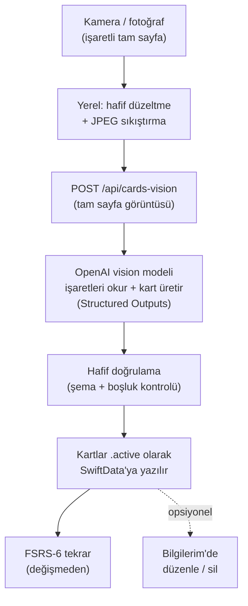

# Faz 6 — Vision-öncelikli kişisel yeniden tasarım (B)

**Durum:** B1 (backend) uygulandı ve testlerle doğrulandı; B2'nin test
edilebilir katmanı (iOS `BackendCardProvider`) uygulandı. Derin B2 (pipeline/
kuyruk/arayüz sadeleştirmesi) henüz yapılmadı. Ayrıntı §9 tablosunda.
Çalışma dalı: `faz6-vision`.

**Karar kaydı:** [`docs/ADR-005-kisisel-vision-yeniden-tasarim.md`](ADR-005-kisisel-vision-yeniden-tasarim.md)
— bu fazın *neden* yapıldığı ve hangi ANA-PLAN ilkelerini gevşettiği orada.

---

## 0. Bir cümlede

Deterministik işaret-tespiti + OCR-uzlaştırması + onay-kapıları makinesini ana
akıştan çıkar; yerine **"işaretli sayfa fotoğrafını doğrudan OpenAI vision
modeline gönder, model önemsenen kısmı okuyup zenginleştirilmiş kartları üretsin,
kartlar onaysız desteye girsin"** akışını koy. FSRS tekrarını, depolamayı ve
arayüzü olduğu gibi tut.

## 1. Neden bu faz küçük (önemli)

Bu bir "sıfırdan uygulama" değil. İki gerçek bunu küçük tutuyor:

1. **Vision çağrısı zaten var.** `backend/providers/openai.ts` içindeki
   `OpenAICardGenerator.generateCards` şu an bile modele hem metin hem
   **`input_image`** gönderiyor (satır 218–226) ve Structured Outputs ile §14
   şemasına kilitliyor. Yani "fotoğrafı modele gönder" altyapısı hazır — sadece
   *ne* gönderdiğimizi ve *nasıl* sorduğumuzu değiştiriyoruz.
2. **`/api/cards` zaten görüntü kabul ediyor.** `backend/api/_cards.ts` bugün
   `imageBase64` + `mimeType` alıyor (satır 138–150). Değişecek olan tek şey:
   `cleanText` zorunluluğunu kaldırmak ve önce Google OCR + uzlaştırma
   beklemeyi bırakmak.

Kısacası B, **eklemekten çok silmek**. Karmaşıklığın çoğu (piksel tespiti,
uzlaştırma, kritik-token kapıları, onay akışı) *var olma sebebini* kaybediyor.

## 2. Yeni mimari



Karşılaştırma — bugünkü (süperseded) akış: `kamera → sayfa düzeltme → Apple
Vision → cihaz-üstü işaret tespiti → Google Document AI → grounding → OCR
snapshot → fotoğraf-üstü onay → grup başına kart → kalite kapısı → needsReview /
ready`. Faz 6 bu zincirin ortasındaki her şeyi tek bir vision çağrısıyla
değiştirir.

## 3. Ne kalır / ne değişir / ne kaldırılır (dosya bazlı)

### 3.1 Korunur (dokunma)

| Alan | Dosya(lar) | Not |
|---|---|---|
| FSRS-6 tekrar motoru | `ios/CizgiCore/.../Scheduling/`, `evals/fsrs/` | Faz 4, test edilmiş. Değişmez. |
| Veri modeli & depolama | `ios/CizgiCore/.../Models/Models.swift`, `Enums.swift` | Card/KnowledgeUnit/ReviewLog korunur; alan sadeleşmesi §6. |
| Tekrar & kütüphane arayüzü | `ios/App/Features/Review/`, `Library/` | Kart gösterimi, tekrar akışı aynı. |
| Yakalama arayüzü | `ios/App/Features/Capture/` | Kamera/fotoğraf; işaret önizlemesi sadeleşir. |
| Backend iskeleti & auth | `backend/api/_auth.ts`, `backend/config.ts` | Cihaz-token doğrulaması, config yükleme aynı. |
| Vision çağrısı | `backend/providers/openai.ts` | `input_image` zaten var; prompt & şema değişir (§4, §6). |
| Görüntü yükleme | `ios/CizgiCore/.../Backend/UploadImage.swift`, `BackendClient.swift` | Uç nokta adı/gövdesi değişir, taşıma aynı. |

### 3.2 Değişir

| Alan | Dosya(lar) | Değişiklik |
|---|---|---|
| Kart üretim promptu | `backend/prompts/cardGeneration.ts` | Kaynağa-sadıktan → işaret-odaklı, zenginleştirmeli vision okuması (§4). |
| Kart uç noktası | `backend/api/_cards.ts` (veya yeni `_cardsVision.ts`) | `cleanText` zorunluluğunu kaldır; tam sayfa görüntüsünü kabul et; OCR/uzlaştırma bekleme. |
| Kalite kapısı | `backend/providers/cardGate.ts` | Varsayılan **auto_accept**; `explanation`/`enriched` artık onay tetiklemez. Yalnız çok temel sağlık kontrolleri (boş kart, boş front/back) kalır. |
| Çıktı sözleşmesi | `backend/schemas/llm_output.schema.json`, `llmOutputTypes.ts` | Sadeleşir (§6): `transcription`/`sourceFaithful`/`enriched`/kritik `riskFlags` alanları isteğe bağlı/kaldırılır. |
| iOS kart sağlayıcı | `ios/CizgiCore/.../Providers/BackendCardProvider.swift` | `requiresUserApproval` eşlemesi kalkar; kartlar `.active` üretilir. |
| iOS yakalama hattı | `ios/CizgiCore/.../Queue/CapturePipeline.swift` | Tespit/gruplama/OCR/onay adımları çıkar; "görüntü → /api/cards-vision → kaydet" kalır. |
| Kuyruk durumları | `ios/CizgiCore/.../Queue/StateMachine.swift`, `ios/App/Features/ProcessingQueue/` | `confirmationRequired`/`needsReview` durumları ana akıştan çıkar. |

### 3.3 Ana akıştan çıkar (kod **silinmez**, çağrılmaz — ADR-005 geri dönüş için)

- Backend: `providers/documentAI.ts`, `reconcile.ts`, `gate.ts`,
  `criticalTokens.ts`, `sequenceMatcher.ts`, `googleAuth.ts`, `api/_ocr.ts`.
- iOS: `MarkerDetection/*`, `Annotation/*` (grounding), `OCR/ReadingOrder.swift`,
  `App/Features/Confirmation/*`.
- Bu kodların testleri "arşiv/regresyon" olarak ayrılır (§8); CI'da ana-akış
  testlerini bloklamaz.

## 4. Yeni kart üretim promptu (taslak v2.0)

`backend/prompts/cardGeneration.ts` içeriği aşağıdakiyle değişir. Bu bir
**başlangıç taslağıdır**; asıl iş B3'te bunu gerçek sayfalarla iyileştirmektir.

> Sen bir TUS/tıp öğrencisinin kişisel çalışma asistanısın. Sana bir ders
> kitabı sayfasının fotoğrafı veriliyor. Öğrenci bu sayfada önemli gördüğü
> yerleri **fosforlu kalemle işaretlemiş, altını çizmiş, daire içine almış,
> yıldız/artı/T gibi semboller koymuş ve kenarlara/satır aralarına el yazısıyla
> kendi notlarını eklemiş** olabilir.
>
> Görevin: **öğrencinin işaretleyerek "bunu öğrenmek istiyorum" dediği bilgiyi
> yakalamak** ve bundan nitelikli öğrenme kartları üretmek.
>
> Kurallar:
> 1. **Önceliğin işaretli/vurgulanmış içeriktir.** Fosforlu, altı çizili,
>    dairelenmiş veya yanına not düşülmüş kısımlara odaklan. İşaretlenmemiş
>    çevre metni yalnız işaretli bilgiyi anlamak için bağlam olarak kullan.
> 2. **El yazısı notları öğrencinin niyet sinyalidir.** Bir terimin yanına not
>    almış veya daire içine almışsa, o terim/kavram sınavda önemsediği şeydir;
>    kartı ona göre kur. El yazısını okuyabildiğin kadar oku; emin olmadığın
>    yeri uydurma, "(el yazısı okunamadı)" diye geç.
> 3. **Zenginleştirmeye izin var.** Cevabı yalnız sayfadaki kelimelerle
>    sınırlama; kavramı daha iyi öğretmek için mekanizma, ayırt edici nokta,
>    klinik bağlam ve sık karıştırılanları ekleyebilirsin. Amaç öğrencinin
>    çalışmasını **kısaltmak**: dağınık bir sayfayı sınanabilir, net kartlara
>    çevir.
> 4. **Türkçe üret.** Tıbbi terimleri Türkçe tıp eğitiminde kullanıldığı
>    biçimde yaz.
> 5. **Kart tipleri:** doğrudan hatırlama, boşluk doldurma (cloze), mekanizma,
>    ayırt etme, istisna/tuzak. Bir sayfadan **anlamlı biçimde farklı** en fazla
>    N kart üret (N = config'ten, `maxCardsPerKnowledgeUnit`). Aynı bilgiyi
>    yüzeysel tekrarlayan kart üretme.
> 6. **Emin olmadığında bunu kartın içinde belirt** (ör. arkada "(sayfadaki
>    değer net okunamadı)"), ama akışı durdurma — onay isteme.
> 7. Çıktıyı verilen JSON şemasına tam uydur.

`buildUserInstruction` (openai.ts) sadeleşir: artık "şu uzlaştırılmış metni
değiştirme" demez; yalnız `requestId` ve (varsa) kullanıcının serbest ipucunu
(bkz. §5 opsiyonel `hint`) taşır.

## 5. Backend değişiklikleri

### 5.1 Uç nokta sözleşmesi

Yeni (veya `_cards.ts` üzerinde revize) `POST /api/cards-vision`:

**İstek gövdesi:**
```jsonc
{
  "jobId": "uuid",              // istemci üretir, çıktının requestId'i olur
  "imageBase64": "...",         // işaretli TAM sayfa (crop değil)
  "mimeType": "image/jpeg",
  "hint": "opsiyonel: 'sadece sol sütun' gibi serbest kullanıcı ipucu"
}
```

**Yanıt (başarı):**
```jsonc
{ "jobId": "uuid", "output": { /* sadeleşmiş §14, bkz. §6 */ }, "cardPromptVersion": "2.0" }
```

Değişecek noktalar (`_cards.ts`):
- `cleanText` zorunluluğu **kaldırılır** (satır 152–159 silinir).
- `selectedLineIds`/`isHandwritten` alanları kaldırılır.
- `runCardGate` çağrısı korunur ama kapı sadeleşir (§5.3).
- Maliyet üst-sınır kontrolü (satır 172–182) korunur — tam sayfa görüntüsü
  crop'tan büyük olduğu için input maliyeti artar; `MAX_IMAGE_BYTES` ve
  çözünürlük dengesine dikkat (§7).

### 5.2 Görüntü: tam sayfa, makul çözünürlük

Vision modelinin fosforu, daireyi ve el yazısını görebilmesi için crop değil
**tam sayfa** ve yeterli çözünürlük gerekir. Ama maliyet/çözünürlük dengesi
var (§7). Başlangıç: uzun kenar ~1600 px, JPEG kalite ~0.7. İstemci tarafında
`UploadImage.swift` zaten yeniden boyutlandırma/sıkıştırma yapıyor; parametreler
config'e taşınır.

### 5.3 `cardGate` sadeleşmesi

`verdictForCard` şu davranışa iner:
- **Kaldırılır:** `explanation → quick_confirm` (satır 146–154); `enriched →
  quick_confirm` (171–174); kritik-token reddi (118–131); source-fidelity reddi
  (156–159); §19.2 risk-bayrağı yükseltmeleri (161–168).
- **Kalır:** boş `front`/`back` → `reject` (bozuk kart desteye girmesin); pasaj
  başına kart limiti (`maxCardsPerKnowledgeUnit`).
- Sonuç: her sağlıklı kart `auto_accept`. Onay yalnız kullanıcının kendi
  isteğiyle sonradan (Bilgilerim'de düzenle/sil) devreye girer.

> Not: `cardGate.ts` ve `gate.ts` içindeki kritik-token motoru **silinmez**;
> ADR-005'in "geri dönüş" maddesi için config bayrağı (`SAFE_MODE=true`) ile
> eski davranış geri getirilebilir. Bu opsiyoneldir, B'nin çıkışını bloklamaz.

### 5.4 Model & config

- `OPENAI_MODEL` env-güdümlü kalır (§0.6, §11.3). **Vision-yetenekli** bir
  model olmalı (bugünkü `gpt-5.6-sol` zaten `input_image` ile kullanılıyor).
- `OPENAI_REASONING_EFFORT` `low` → `medium`/`high` denenir (config.ts:166);
  işaret okuma + zenginleştirme daha çok muhakeme isteyebilir. Ölçülür.
- `OPENAI_MAX_OUTPUT_TOKENS` yükseltilebilir (reasoning token'ları da bu
  bütçeden düşüyor — openai.ts:261 uyarısı geçerli).

## 6. Sadeleşmiş çıktı sözleşmesi (§14 → v2)

Amaç: modeli kaynağa-sadakat muhasebesiyle uğraştırmak yerine iyi kart
üretmeye odaklamak. `llm_output.schema.json` + `llmOutputTypes.ts` revize edilir.

- **Card'dan çıkar/isteğe bağlı olur:** `sourceQuote`, `sourceLineIds`,
  `sourceFaithful`, `enriched` (artık her kart zenginleştirilebilir).
- **Card'da kalır:** `id`, `type`, `front`, `back`, `explanation` (opsiyonel),
  `difficulty`, `tags`.
- **`transcription` bloğu isteğe bağlı/kaldırılır:** artık ayrı bir
  transkripsiyon-doğrulama adımı yok. İstenirse modelin okuduğu ham metni
  audit için `readText` (opsiyonel) alanında tutabiliriz.
- **`riskFlags` sadeleşir:** yalnız modelin kendi "emin değilim" sinyali
  (`low_confidence`) opsiyonel kalır; kartın içinde de görünür (§4 kural 6).
- **`usage`** (maliyet) korunur — `ModelRun` (§16.8) hâlâ maliyet takibi için
  bunu istiyor.

Karşılıklı sürüm: `schemaVersion: "2.0"`. iOS `Models.swift` ve
`BackendCardProvider.swift` yeni şemaya göre güncellenir; kaldırılan alanlar
SwiftData migration ile düşürülür (kişisel tek-cihaz olduğu için basit).

## 7. Maliyet

Tek kullanıcı için önemsiz ama kaydedilmeli (§0.6, §20.3 — uydurma rakam yok):

- Tam sayfa görüntü input token'ı crop'tan fazla; sayfa başına birkaç sent
  mertebesi beklenir. Gerçek rakamlar ilk çağrılarda `ModelRun.usage`'dan
  okunur ve `OPENAI_USD_PER_MILLION_*` config'i sağlayıcının fiyat sayfasından
  doldurulur (hâlâ 0; CLAUDE.md "Sıradaki iş" #3).
- `maxUsdPerCardGeneration` kapısı korunur; tam sayfa için üst sınır yeniden
  ölçülüp ayarlanır.

## 8. Test planı

- **Backend birim testleri:** `_cards.ts`/`cardGate.ts` için yeni davranış
  (cleanText'siz istek kabul; auto_accept varsayılanı; boş kart reddi).
  Google/reconcile testleri "arşiv" klasörüne taşınır, ana koşudan çıkar.
- **iOS testleri:** `CapturePipeline` sadeleşmiş akış (görüntü → kart → active);
  marker/annotation testleri arşive alınır. `swift test` yeşil kalmalı.
- **Prompt/kalite (asıl iş, B3):** gerçek sayfalarla iteratif. Ölçüt sayısal
  bir rubrikten çok kullanıcının kendi kabulü ("bu kartlarla çalışır mıyım?").
  İsteğe bağlı: 5–10 gerçek sayfadan üretilen kartların kullanıcı tarafından
  hızlı "iyi/düzelt/sil" etiketlemesi; kabul oranı prompt sürümleri arasında
  karşılaştırılır. Telifli sayfa repoya konmaz (`evals/fixtures/` gitignore'lu).

## 9. Aşamalı uygulama ve tahmini süre

> Tahminler odaklı çalışma içindir; en büyük değişken kod değil **prompt
> kalite döngüsüdür** (B3).

| Adım | Kapsam | Durum / Tahmini |
|---|---|---|
| **B0** | Bu belge + ADR-005 + roadmap güncellemesi | ✅ Önceki oturum |
| **B1** | Backend: yeni prompt (v2.0), `/api/cards-vision`, `cleanText` kaldır, `cardGate` sadeleştir (auto_accept), şema v2, testler | ✅ **Uygulandı** (2026-08-05). Backend 425 test + Python 513 test yeşil; `tsc` temiz. Bkz. "Uygulama notu" altta. |
| **B2** | iOS: yakalama → tam sayfa gönder → kartları `.active` kaydet; tespit/gruplama/onay adımlarını akıştan çıkar; kuyruk sadeleştir | 🟡 **Büyük kısmı yapıldı (CizgiCore).** `BackendCardProvider` → `/api/cards-vision`, v2 çözümleme, kartlar `.active`. **`CapturePipeline.run()` vision akışına çevrildi**: tam sayfa → `/api/cards-vision` → tek sentetik tam-sayfa grupla `.ready`; yerel OCR/işaret-tespiti/gruplama/onay ana akıştan çıktı (OCR-era parametreler imzada duruyor ama yok sayılıyor). OCR-akış pipeline testleri §8 gereği arşivlendi; korunan birim testleri yeşil. `swift build` + `swift test` **185 yeşil**. **Kalan (App hedefi, bu ortamda derlenemez, gerçek cihaz gerekir):** `ConfirmationView`'ı navigasyondan çıkar, `ProcessingQueue.persist`'te tam-sayfa crop'u atla, `needsReview`/`confirmationRequired` arayüz bölümlerini kaldır, `Models` alan sadeleşmesi + SwiftData göçü. |
| **B3** | Gerçek sayfalarla prompt kalite döngüsü (işaret odağı + el yazısı okuma) | 🟡 **İterasyon sürüyor.** v2.1 → **v2.2** (ilk cihaz testi bulgusu): model tüm basılı sayfayı `readText`'e transkribe edip en temel olgulardan kart üretiyordu, el yazısı kenar notlarını atlıyordu. İki kök neden + düzeltme: **(P1)** `input_image`'a `detail:"high"` eklendi (yoksa API sayfayı düşük çözünürlükte karolar, ince el yazısı/fosforlu kaybolur) → `OPENAI_IMAGE_DETAIL` config; `OPENAI_REASONING_EFFORT` `medium`→`high`. **(P2)** prompt v2.2: önce işaretleri bul, `readText`'e YALNIZ işaretli/el yazısı içeriği yaz (tüm sayfayı değil), işaretsizden kart üretme, okunabilen her el yazısı ≥1 kart. Backend 426 test yeşil. Backend-only — yeniden çekerek test edilir. |
| **UI** | Sıcak-çalışma redesign (marka uyumlu amber+lacivert) + Faz 6 App temizlikleri | ✅ **Yapıldı ve `xcodebuild` ile derlendi (BUILD SUCCEEDED).** Tasarım sistemi (`App/Theme/CizgiTheme.swift`); Yakala/Tekrar(flashcard)/Bilgilerim + Kart detay yeniden tasarlandı; sekme çubuğu amber tint; Kuyruk temalandı; `ConfirmationView` navigasyondan çıktı; boş `sourceQuote` gizlendi; `persist`'te tam-sayfa crop atlandı. |
| **B4** | Cila: maliyet takibi, hata/çevrimdışı kuyruk, FSRS bildirimleri (Faz 4 kalanı) | ~3–5 gün |

### Uygulama notu — B1 + B2 test edilebilir katman (2026-08-05)

Karar: kart yolu **yerinde v2'ye revize edildi** (§3.2). §3.3'ün "geri dönüş için
silinmez" listesindeki modüller (OCR/reconcile/detection: `documentAI.ts`,
`reconcile.ts`, `gate.ts`, `criticalTokens.ts`, `googleAuth.ts`, `_ocr.ts`,
iOS `MarkerDetection/*`, `Annotation/*`, `OCR/*`, `Confirmation/*`) **hiç
dokunulmadı** — hepsi diskte, testleri yeşil.

Somut değişiklikler:
- **Şema v2** (`backend/schemas/llm_output.schema.json`, `schemaVersion: "2.0"`):
  `transcription`/`knowledgeUnits`/`quality` blokları ve kartın
  `sourceQuote`/`sourceLineIds`/`sourceFaithful`/`enriched`/`riskFlags`
  alanları kaldırıldı; kart artık `tags` + boolean `lowConfidence` taşıyor;
  `readText` (opsiyonel audit) eklendi; `usage` korundu. `$defs.riskFlag` ve
  `RISK_FLAGS`/`RiskFlag` enum'ları **bilerek korundu** — SAFE_MODE geri dönüşü
  ve TS/Swift/Python anti-drift senkron testlerini tek kaynaktan tutmak için
  (v2 kart bunları kullanmıyor).
- **Prompt v2.0** (`backend/prompts/cardGeneration.ts`): §4 taslağı
  (işaret-odaklı, zenginleştirmeli, el yazısı okuma, "onay isteme").
- **`openai.ts`**: `CardGenerationRequest` → `{ requestId, image (tam sayfa),
  mimeType, hint? }`; `buildUserInstruction` `cleanText` yerine opsiyonel
  `hint`.
- **`cardGate.ts`**: sadeleştirildi — her sağlıklı kart `auto_accept`; yalnız
  boş front/back → `reject` ve pasaj limiti. Eski kritik-token motoru
  `gate.ts`/`criticalTokens.ts`'te duruyor (reconcile.ts hâlâ kullanıyor).
- **`api/_cards.ts`**: `cleanText`/`selectedLineIds`/`isHandwritten` zorunlulukları
  kaldırıldı; opsiyonel `hint`; maliyet üst-sınırı korundu. Rota
  `/api/cards-vision` (eski `/api/cards` de geçişte aynı handler'a bağlı).
- **iOS `BackendCardProvider.swift`**: `/api/cards-vision`'a gidiyor, v2
  çözümlüyor, kartları `.active` üretiyor (onay yok); `CardGenerationRequest`'e
  opsiyonel `hint` eklendi. `GeneratedCard`/`GeneratedKnowledge` şekilleri
  (App hedefi bağımlı) korundu; v2 alanları bunlara eşlendi.

### Uygulama notu — B2 pipeline çekirdeği (2026-08-05)

`CapturePipeline.run()` **vision akışına çevrildi** (CizgiCore, test edilebilir):

- Akış artık: tam sayfa görüntüsünü hazırla (`prepareUpload`) → `generator.generate`
  (gerçek sağlayıcı `/api/cards-vision`'a gider) → başarılıysa `.ready`, tek
  **sentetik tam-sayfa `GeneratedAnnotationGroup`** ile (kutu 0,0,1,1). Yerel
  OCR, işaret-tespiti, cloud OCR, grounding ve onay kapısı ana akıştan **çıktı**.
- **İmza ve `PipelineOutcome` şekli korundu**: OCR-era parametreler (`snapshot`,
  `selectionOverride`, `selectionResultOverride`, `completedGroupIds`) kabul
  edilip yok sayılıyor. Böylece App hedefindeki `ProcessingQueue` **hiç
  değişmeden** var olan `.ready`/`generatedGroups` yolundan kartları `.active`
  kaydediyor; onay/`needsReview` dalları artık ölü (ulaşılmaz) ama zararsız.
- Kullanılmayan OCR-yolu private helper'ları (`cloudReading`, `outcome(for:)`,
  `logGroundingDiagnostics`) düştü; korunan modüller (`documentAI`/`reconcile`/
  `MarkerDetection`/`Annotation`/`Confirmation`) diskte, kendi birim testleri
  yeşil.
- OCR-akış pipeline testleri (`CapturePipelineTests` eski hali,
  `BackendPipelineTests` cloud/reconcile/confirmation sınıfları,
  `ReconciliationPassthroughTests`) **§8 gereği arşivlendi**; yerlerine vision
  akış testleri yazıldı. `LineOverlapTests`/`MimeTypeTests`/
  `RemoteRecognitionStyleInfoDecodingTests`/`MockCardProviderTests` korundu.

**Offline sınır:** backend yapılandırılmadığında generator `MockCardProvider`
olur; vision modunda OCR pasajı olmadığı için mock `sourceInsufficient` verir →
`permanentFailure`. Faz 6 yapılandırılmış bir backend bekler; bu dürüst
davranış dokümante edildi.

**Kalan (App hedefi, bu ortamda derlenemez — gerçek cihaz doğrulaması):**
`ConfirmationView`'ı navigasyondan çıkarma, `persist`'te tam-sayfa crop'u atlama,
`needsReview`/`confirmationRequired` arayüz bölümleri, `Models` alan sadeleşmesi
+ SwiftData göçü. Bkz. §11 kabul kriterleri.

**Kullanılabilir v1:** ~1–2 hafta. **Oturmuş sürüm:** ~3–4 hafta.

## 10. Riskler ve açık sorular

1. **El yazısı okuma.** Vision modeli basılı Türkçeyi iyi, yoğun/eğik el
   yazısını değişken okur. Azaltma: prompt'ta "emin değilsen uydurma" kuralı;
   kullanıcı hata riskini kabul etti. B3'te ölçülür.
2. **"Sadece işaretlediğimi al" güvenilirliği.** %70–80 fosforlu sayfada model
   yine de "her şey önemli" diyebilir. Azaltma: el yazısı/daire/yıldız gibi
   *ikincil* işaretleri "en yüksek öncelik" sinyali yapan prompt; gerekiyorsa
   kullanıcının serbest `hint`'i (§5.1). Denemeden %100 garanti edilemez.
3. **Sayfa çözünürlüğü vs maliyet/gecikme.** Çok küçük → işaret görünmez; çok
   büyük → yavaş/pahalı. §5.2 başlangıç değerleri ölçümle ayarlanır.
4. **Şema göçü.** Kaldırılan alanlar için SwiftData migration; tek cihaz
   olduğu için düşük risk, yine de mevcut kartlar korunmalı.
5. **App hedefi bu ortamda çalıştırılamıyor.** Davranış doğrulaması gerçek
   cihaz/simülatör gerektirir (CLAUDE.md'deki süregelen kısıt). B2/B3 gerçek
   telefonda doğrulanmalı.

## 11. Kabul kriterleri (B "bitti" ne demek)

- İşaretli bir sayfa fotoğrafı çekildiğinde, **hiçbir onay adımı olmadan**,
  kartlar doğrudan aktif desteye giriyor.
- Üretilen kartlar ağırlıklı olarak kullanıcının **işaretlediği/not aldığı**
  içeriğe karşılık geliyor (işaretlenmemiş rastgele metne değil).
- Kartlar salt kaynak kelimelerini tekrar etmiyor; en az bir kısmı mekanizma/
  ayırt etme/klinik bağlamla **zenginleştirilmiş** ve kullanıcı bunları
  "çalışmamı kısaltıyor" diye kabul ediyor.
- FSRS tekrar akışı ve Bilgilerim (düzenle/sil) eskisi gibi çalışıyor.
- `swift test` ve backend test paketi (ana-akış) yeşil.

## 12. Geri dönüş

Eski deterministik akış kodu silinmediği için, istenirse `SAFE_MODE`/config
bayrağıyla (ADR-005) kaynağa-sadık + onaylı akış geri getirilebilir. B, eski
kodu yok etmez; ana akışı değiştirir.
